# Documents Test Driven refactoring of the kata

## 1. Run default test
   
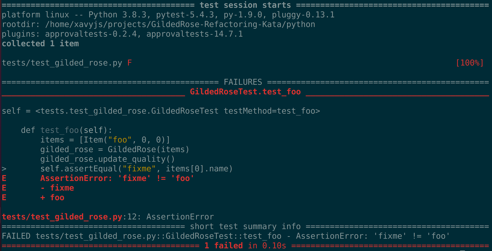

**Fix: Correct method name 'fixme' to 'foo'**

**1. Check Item Name is constant always**

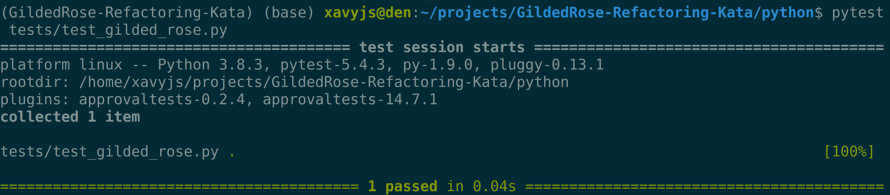

## 2. Add test cases for base requirements
**2. Check Item SellIn**  
**3. Check Item Quality** 

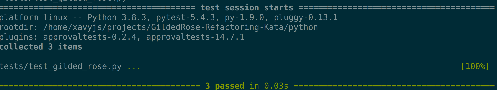

## 3. Add test cases for Finer Constraints
**4. Check Item Quality is never Negative**  
**5. Check Item Quality is never more than 50**  
**6. Check Item Quality degrade after SellIn**

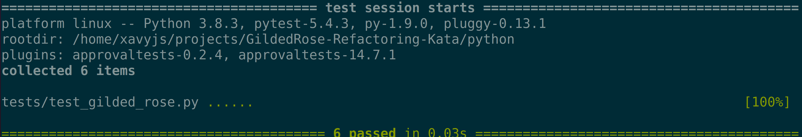

## 4. Major refactor of glided_rose and test_glided_rose
**1.Refactor GlidedRose Class to python function as the Class only has behavior and data is not native(instantied by a different class i.e. Item)**  
**2. Move Item class to a seperate .py file for easier maintenance**  
**3. Adding Type Hints for better readability on 1 and 2**  
**4. Refactor test_glided_rose to adapt to changes from 1 to 3**

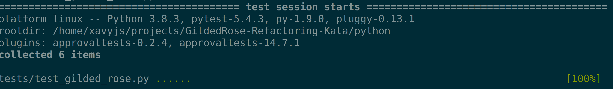

## 5. Adding Tests for straight forward cases
**1. Aged Brie**  
**2. Sulfuras** 

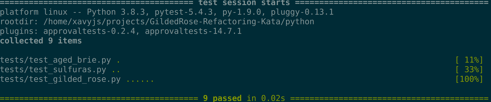

## 6. Adding Tests for backstage

**1. Increase in Quality w.r.t SellIn**  
**2. Quality +2 when days leq 10**  
**3. Quality +3 when days leq 5**  
**4. Quality drops to 0 post concert**

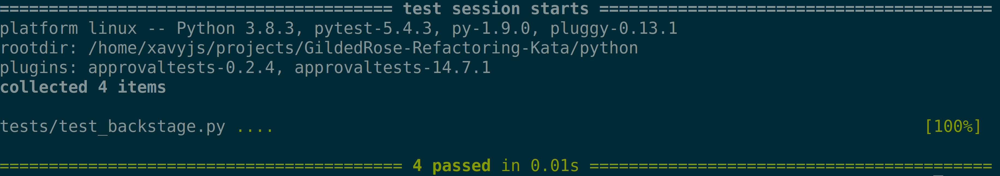

## 7. Refactoring gilded_rose

**1. Seperating loops and iter instance**  
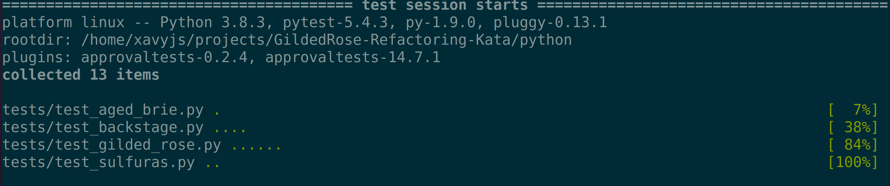

**2. Re-ordering setters for sell in and quality**  
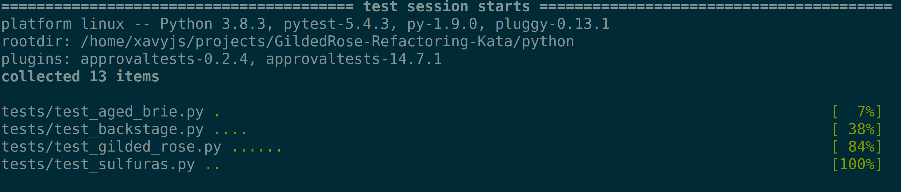

**3. Replacing Item Strings by Constants to avoid frequent typos**  
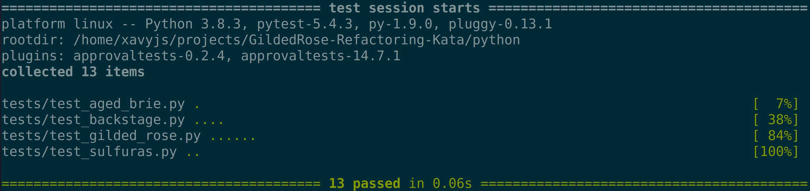

**4. Refactor nested item quality checks with functions**  

**5. Increase readability of conditionals with inversion of condition**  
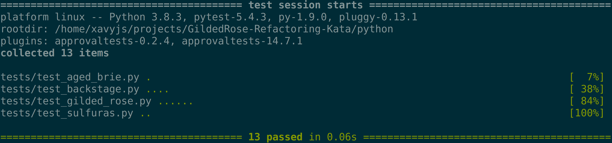

**6. Simplify conditionals by collapsing logic**  
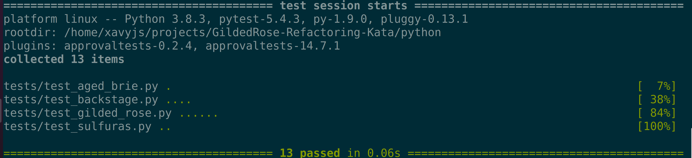

